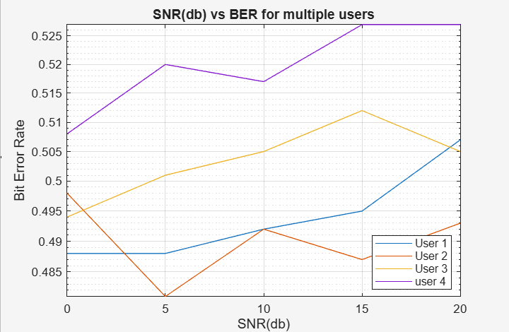

# CDMA Simulation in MATLAB

This project implements a **Direct Sequence CDMA (DS-CDMA)** system with multiple users in MATLAB. It was developed as a practical extension of the concepts learned in the **NPTEL course: Principles of Modern CDMA, MIMO, and OFDM Wireless Communications**.

---

## 📌 Features
- Generates random bit sequences for multiple users
- Uses **Hadamard codes** for spreading
- Simulates transmission over an **AWGN channel**
- Performs **despreading** and bit detection at the receiver
- Calculates and plots **Bit Error Rate (BER) vs SNR (dB)** for multiple users

---

## 🖥️ Simulation Details
- **Number of Users**: 4  
- **Code Length**: 8 (Hadamard spreading codes)  
- **Channel**: Additive White Gaussian Noise (AWGN)  
- **Performance Metric**: BER vs SNR (0 to 20 dB)  

---

## 📊 Results
- BER performance degrades with increasing number of users due to **multi-user interference**.
- The BER vs SNR curves show how error probability reduces as SNR increases.
- Trade-off between **capacity and reliability** in CDMA systems is clearly observed.

---

## 🚀 Future Work
- Extend to **MIMO systems**  
- Integrate with **OFDM modulation**  
- Compare CDMA with other multiple-access schemes  

---

## 📂 Files
- `CDMA_simulation.m` → Main MATLAB script
- `SNR vs BER plot` → Main MATLAB script  
- `README.md` → Project documentation  

---

## 📜 Acknowledgment
This project is based on concepts from the **NPTEL course (IIT)** on *Principles of Modern CDMA, MIMO, and OFDM Wireless Communications*.  

---

## 🔗 Author
**Akshat Gupta**  
3rd Year B.Tech (ECE) | Analog VLSI & Wireless Communication Enthusiast  
